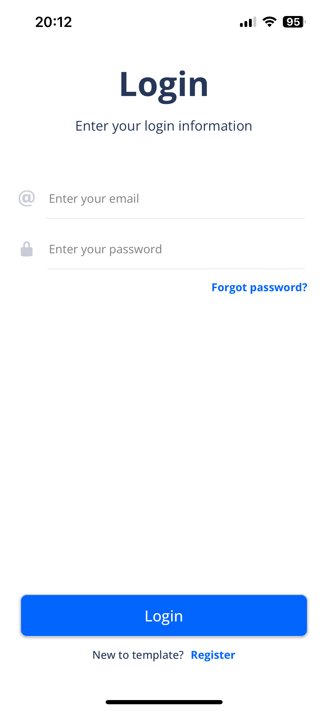

---

# React Native Template


This project is a React Native template designed to accelerate development by providing essential features such as state management, internationalization, data fetching, navigation, and reusable components.

## Screenshots

Created using the default components provided in the project.

### Welcome Screen


### Login Screen



### Register Screen


## Features

- **🌍 Internationalization (i18n)**
  - Multi-language support using `react-i18next` for seamless localization.

- **🗃️ State Management with Redux**
  - Centralized state management for efficient global state access and updates.

- **🔍 Data Fetching with React Query**
  - Optimized data fetching, caching, and synchronization.

- **🧭 Navigation**
  - Smooth and intuitive navigation using `react-navigation` with base components like `VStack` and `HStack`.

- **⚛️ Component-Based Architecture**
  - Modular design with reusable UI components and consistent styling.

- **📦 Common Utilities**
  - Helper functions and utilities for streamlined development.

- **🔗 Axios Management**
  - Configurable API requests using Axios with built-in error handling and response management.

- **🌐 WebSocket Management**
  - Real-time communication support using WebSockets.

- **🍪 Cookie Management**
  - Simplified management of cookies for authentication and user sessions.

- **🔒 Authentication**
  - User authentication and registration with secure token management.

## Components

The project includes a set of reusable components for building user interfaces:

- **Button Components**
  - `button.tsx`: Standard button component with customizable styling.

- **Typography Components**
  - `h1.tsx`, `h2.tsx`: Heading components for consistent typography.
  - `text.tsx`: Customizable text component for displaying content.

- **Input Components**
  - `input.tsx`: Basic input field component.
  - `input-with-icon.tsx`: Input field with an icon for enhanced user interaction.

- **Layout Components**
  - `vstack.tsx`: Vertical stack layout for arranging elements vertically.
  - `hstack.tsx`: Horizontal stack layout for arranging elements horizontally.
  - `spacer.tsx`: Spacer component for adding flexible space between elements.

- **Navigation Components**
  - `navbar.tsx`: Customizable navigation bar for app header.

- **Image Components**
  - `image.tsx`: Image component for displaying images with caching support.

- **Utility Components**
  - `separator.tsx`: Divider component for separating content.
  - `separator-with-text.tsx`: Divider with text for enhanced UI.
  - `switch.tsx`: Toggle switch component for boolean inputs.

- **Index File**
  - `index.ts`: Central export file for components.

## 🚀 Getting Started

### Prerequisites

Ensure you have the following installed:

- Node.js (v14 or higher)
- Yarn
- Android Studio / Xcode for Android/iOS development

### Installation

1. **Clone the repository:**

   ```sh
   git clone https://github.com/YourUsername/ReactNativeTemplate.git
   cd ReactNativeTemplate
   ```

2. **Install dependencies:**

   ```sh
   yarn install
   ```

3. **Configure environment variables:**

   Update the `.env` file in the root directory with your configuration settings:

   ```sh
   API_URL='https://your-api-url.com'
   SOCKET_URL='https://your-socket-url.com'
   ```

### Running the Application

1. **Start the Metro Bundler:**

   ```sh
   yarn start
   ```

2. **Run the application on Android:**

   ```sh
   yarn android
   ```

3. **Run the application on iOS:**

   ```sh
   yarn ios
   ```

4. **Access the application:**

   The app will be available on your emulator or device.

### API Documentation

Documentation for API endpoints is available at `http://localhost:3000/api`.

## 🧪 Testing

To run the tests, use the following command:

```sh
yarn test
```

## 🛠️ Scripts

- **🧹 Format code using Prettier:** `yarn format`
- **🏃‍♂️ Start the application:** `yarn start`
- **👨‍💻 Start in development mode:** `yarn android` or `yarn ios`
- **🔍 Lint the code using ESLint:** `yarn lint`
- **🧪 Run the tests:** `yarn test`
- **🚀 Run end-to-end tests:** `yarn test:e2e`

## 📜 License

There is no license; you're free to use it.

## 👤 Author

[Toni Da Rodda](mailto:toni.da.rodda.pro@gmail.com)

## 🛠️ Icons

- **🚀 Deployment**
- **⚙️ Configuration**
- **📄 Documentation**
- **🔧 Maintenance**
- **🔒 Security**
- **📫 Email Integration**
- **📈 Performance Optimization**
- **⚡ Gain Time**

---

Feel free to contribute to this project by submitting issues or pull requests.

For any questions or support, please contact [Toni Da Rodda](mailto:toni.da.rodda.pro@gmail.com).

---